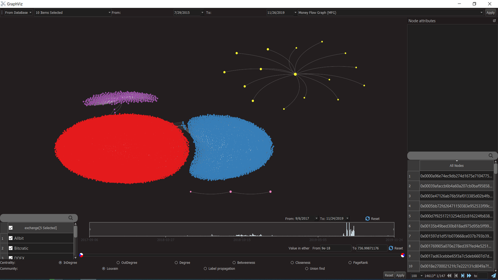

<h1>Evolution Analysis of Ethereum Transactions</h1>

<h2>MSc Thesis: <a href="./thesis.pdf">thesis.pdf</a></h2>

<h2>Requirements</h2>
<ul>
<h3><li>Operating system: Windows</li></h3>
<h3><li>Database: MongoDB</li></h3>
<h3><li>Python version: Python 3.5</li></h3>
<h3><li>Python dependencies: pip install -r requirements.txt</li></h3>
</ul>

<h2>Quickstart</h2>
<ul>
<h3><li>
Database ("ethereum_tx"):

<table>
<tr><td>Collection ("mfg_nodes")</td><td>node_name (str)</td><td>node_type (str)</td></tr>
<tr><td>Collection ("mfg_edges")</td><td>from_name (str)</td><td>to_name (str)</td><td>time_stamp (date)</td><td>value_in_ether (float)</td></tr>
<tr><td>Collection ("ccg_nodes")</td><td>node_name (str)</td><td>node_type (str)</td></tr>
<tr><td>Collection ("ccg_edges")</td><td>from_name (str)</td><td>to_name (str)</td><td>time_stamp (date)</td></tr>
<tr><td>Collection ("cig_nodes")</td><td>node_name (str)</td><td>node_type (str)</td></tr>
<tr><td>Collection ("cig_edges")</td><td>from_name (str)</td><td>to_name (str)</td><td>time_stamp (date)</td><td>number_of_calls (int)</td></tr>
</table>

</li></h3>
<h3><li>Developer version: <a href="./graphViz/main.py">graphViz/main.py</a></li></h3>
<h3><li>Non-developer version: <a href="./graphViz-exe/main.exe">graphViz-exe/main.exe</li></h3>
<h3><li>
Packaging as .exe:

cd .\pyinstaller-develop  
pyinstaller.py --paths python_path\Python35\Lib\site-packages\PyQt5\Qt\bin project_path\graphViz\main.py -w

Copy all content in "pyinstaller-develop/main/dist" to "graphViz-exe" (replace existing content)
</li></h3>
</ul>

<h2>Preview</h2>

<h2>References</h2>
<ul>
<h3><li>GUI widgets: <a href="https://github.com/PyQt5/PyQt">pyqt5</a></li></h3>
<h3><li>Large data visualization: <a href="https://github.com/vispy/vispy">vispy</a></li></h3>
<h3><li>Large graph layout: <a href="https://github.com/pygraphviz/pygraphviz">pygraphviz</a></li></h3>
<h3><li>EXE packaging: <a href="https://github.com/pyinstaller/pyinstaller">pyinstaller</a></li></h3>
</ul>
